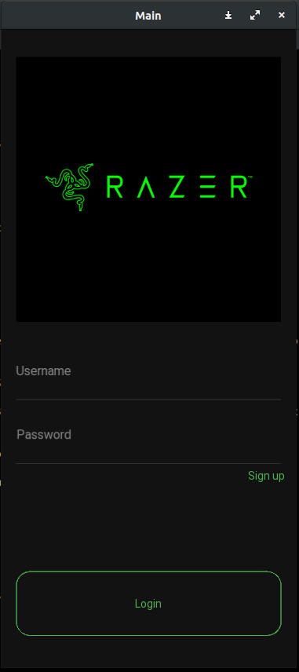
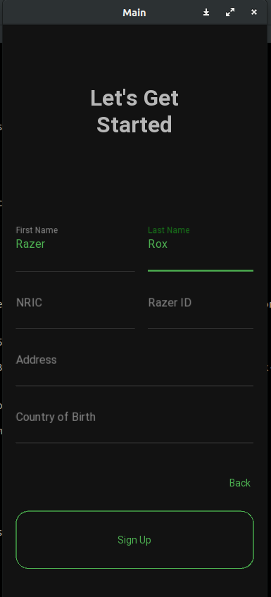
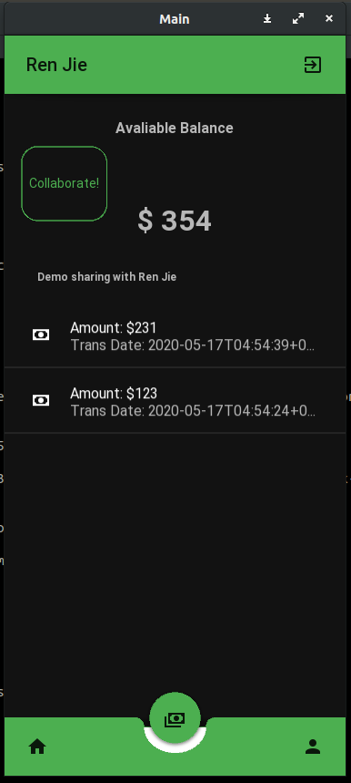
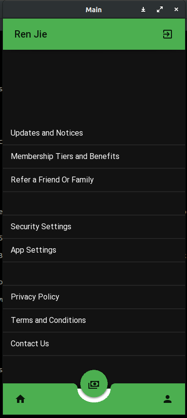

# RazerHackathon2020
## Setup
- Install [Anaconda](https://www.anaconda.com/)
- Clone repository
```bash
git clone https://github.com/notha99y/RazerHackathon2020.git
```
- create conda environment
```bash
conda env create -f environment.yml
```
- activate your conda environment
```bash
conda activate RazerHack
```

## Running the app
```bash
python main.py
```

## Screenshots





## Icons
https://gitlab.com/kivymd/KivyMD/blob/master/kivymd/icon_definitions.py

